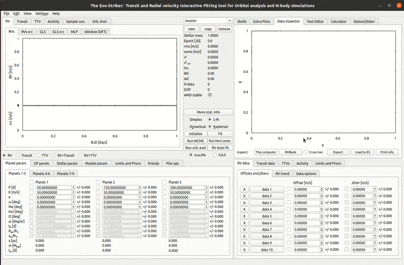

.. _activity:

Stellar activity
.................

It is possible that radial velocity surveys for discovering exoplanets are hampered by stellar factors such as stellar magnetic activity, activity in the stellar chromosphere and photosphere that along with the star rotation can produce a signal which mimics the RV signals expected from an exoplanet around the observed star. Thus it is important to investigate and include activity data while modeling the RV signal.

In RV bank choose between the activity indices listed in the bottom window for the planetary system under analysis. When loaded to Exo-Striker, the data is populated in the **Activity** tab in the *Data panel*.

Go to the *Activity*>*Correlations* tab in the *Visualizations* panel. There are drop-down menus to choose from RV and activity data. Check plot error and plot correlations and choose **Print info** to show if there is any correlation and how strong is it.

.. ATTENTION::
	Note that if you choose to check correlations between activity data and the residual signal, you should uncheck the box next to the 		corresponding planet in the **Parameters panel**, because the activity data should be juxtaposed to a model of a planetary system with one 	planet less.

If there is a correlation between the activity index data and the RV data from the corresponding spectrograph this means that the suspected planet signal is actually periodic stellar activity. 

   *Finding correlations between activity and RV data.*

		
