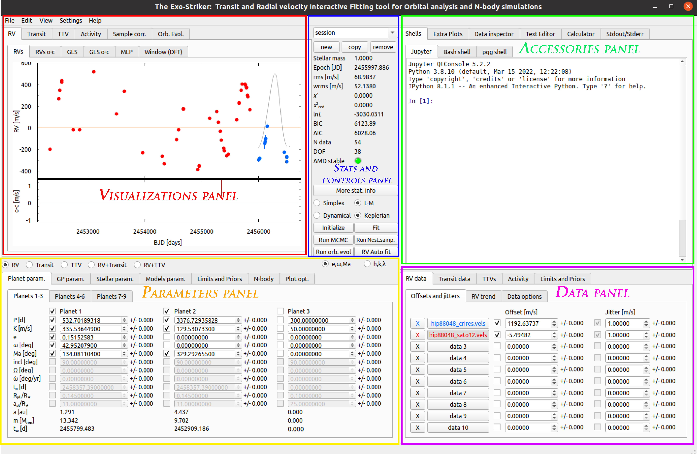

.. _gui:

GUI Layout
..........

This documentation provides information regarding the basic parameters that Exo-Striker uses to determine the goodness of a fit but also the ones that describe the planets orbitals. All of these parameters can be seen on the frontend of the GUI.

   
   *Frontend of the GUI.*

-------------------------------------------------------------------------------------------------------------------------

**Action menu bar**

* *File* : 

	**New session**: New session can be opened from the **new** option in the **Stats and controls panel**.
	
	**Open session**: Open an already created session from a .ses file.
	
	**Open multi session**: Open an already created session from a .mses file.
	
	**Save session**: Save the current session in a .ses file.
	
	**Save multi session**: Save all opened sessions in an .mses file.
	
	**Open RVmod init file**: 
	
	**Open RVBank file**: *In developer mode!*.
	
	**Quit**: You will be prompted to save your session.

* *Edit*: 
	
	**Push Jupyter var. to GUI**:
		
	**RV Auto fit**: Automatically fit the radial velocity data, an option for auto-fit is also available in the Stats and controls panel.
		
	**Reset mid-panel**: *In developer mode!*.

* *View*:

	**Print window GUI to file.**: An option to save the current GUI window in a .png file. Does not output the file.
  	 
   	**Print f-test FAP**: Prints hypothesis testing statistical information in the **Stdout/Stderr** window of the Accessories panel.

   	**Get LaTeX table with parameters**: Outputs a command line to the **Jupyter shell** where table parameters can be modified. When executed, the LaTeX table with best fit parameters is saved to **path** as a .tex file. 

   	**Get LaTex table with priors**: Outputs a command line to the **Jupyter shell** where table parameters can be set. When executed, the LaTeX table with priors is saved to **path** as a .tex file. 

   	**Get RV model**: Outputs a command line that saves a .txt file with modeled radial velocities in m/s per epoch in days.

   	**Get RV data**: Outputs a command line that saves a .txt file with data points information as follows: 
   		* *BJD [days]*
   		* *RVs [m/s]* **or** *RVs o-c [m/s]* with or without jitter and offset added to it, depending on the command line setting.
   		* *RVs errors [m/s]*
   		* *Rank* - The index number of dataset starting from 0, that can be modified in the command line.

   	**Get Orb evol.**: Outputs a command line that saves a .txt file with data as follows:
   		* *Rank*
   		* *Time[years]*
   		* *Semi-major axis[au]*
   		* *Eccentricity*
   		* *Argument of periastron[deg]*
   		* *Mean anomaly[deg]*
   		* *Inclination[deg]*
   		* *Longitude of the ascending node[deg]*

   	**Get All plots**: All plots from the analysis are exported to "exported_plots" folder on your local exostriker directory. Note that in order for the plots to be exported properly, each plot should be opened in advance.

   	**Confidence interval table.**: A new window pops-up with confidence intervals and a Chi-square distribution table below with Chi-values for each P-value/degree-of-freedom pair.
   	
   	
   	

* *Settings*: 

	**Change widget style**: Change style depending on your OS.
	
	**Set GUI font**: Change font style and size of the GUI.
	
	**Set plots font**: Change font style and size of the plots.
		

* *Help*: 

	**Exostriker page on Github**: Opens the Git hub page of the project in a browser.
	
	**Credits**: Opens a pop-up window with credits and utilized packages information.

   .. Note::
      If the GUI freezes or crashes, the most recent session is saved in the **autosave** folder in the **Exostriker** directory after each click on **fit** or **initialize** options, and can be initialized with the following command:
      
      ``python3 exostriker_gui.py -last``

---------------------------------------------------------------------------------------------------------------------------------------------------------------------------------------

Plotting widgets panel
-----------------------

This panel provides a large number of visualizations of transit and radial velocities data and residuals in the frequency domain, stellar activity, sample correlations, evolution of orbital parameters over time. The plots in this panel are interactive and can be expanded, narrowed, zoomed in and out, and exported. If the plot's dimensions are changed, a small button with the letter **A** appears on the left of the plot which restores the default view when clicked.

* *Options menu*: Available with right click on the plot.  
	* **View all**: Click to zoom the plot to default view (same as the **A** button).
	* **X axis**: Options for modification of the 'x' axis.
	* **Y axis**: Options for modification of the 'y' axis.
	* **Mouse mode**: Chose between one or three options to control the plot with the mouse.
	* **Plot options**: Modify the entire plot.
	* **Export...**: Each plot can be exported as a separate image file, vector graphics, matplotlib file, csv, etc. There is an option to save one of the plots in a window or both (entire scene option), which is still not available for export in matplotlib. 

* RV

+------------------+-----------------------------------------------------------------------+
| Parameter name   |           Description                                                 |
+==================+=======================================================================+
| **RVs**          | Radial velocities time series.                                        |
+------------------+-----------------------------------------------------------------------+
| **RVs o-c**      | Radial velocities residuals as a function of time (BJD)               |
+------------------+-----------------------------------------------------------------------+
| **GLS**          | Generalized Lomb-Scargle periodogram of the initial signal            |
+------------------+-----------------------------------------------------------------------+
| **GLS o-c**      | Generalized Lomb-Scargle periodogram of the residual signal           |
+------------------+-----------------------------------------------------------------------+
| **MLP**          | Maximum Likelihood periodogram                                        |
+------------------+-----------------------------------------------------------------------+
| **Window (DFT)** | Discrete Fourier Transform periodogram                                |
+------------------+-----------------------------------------------------------------------+
 
   
   	For more detailed information check the :ref:`rvs` section.
   	

* Transit

+------------------+---------------------------------------------------------------------------------------------+
| Parameter name   |           Description                                                                       |
+==================+=============================================================================================+
| **Tran.**        | Transits time series - relative flux as a function of BJD                                   |
+------------------+---------------------------------------------------------------------------------------------+
| **Tran. o-c**    | Transits residuals                                                                          |
+------------------+---------------------------------------------------------------------------------------------+
| **TLS**          | Transit Least Squares of the initial signal, (Signal Detection Efficiency (SDE)/period[d])  |
+------------------+---------------------------------------------------------------------------------------------+
| **TLS o-c**      | Transit Least Squares of the residual signal, (SDE/period[d])                               |
+------------------+---------------------------------------------------------------------------------------------+
    
   TLS is also periodogram but for transit data.

   For more information check the :ref:`transit` section.
   

* TTV

+------------------+-----------------------------------------------------------------------+
| Parameter name   |           Description                                                 |
+==================+=======================================================================+
| **TTVs**         | Transit-timing variations                                             |
+------------------+-----------------------------------------------------------------------+
| **TTVs o-c**     | TTVs residuals                                                        |
+------------------+-----------------------------------------------------------------------+

* Activity

+------------------+-----------------------------------------------------------------------+
| Parameter name   |           Description                                                 |
+==================+=======================================================================+
| **Time series**  | Activity time series                                                  |
+------------------+-----------------------------------------------------------------------+
| **GLS**          | Generalized Lomb-Scargle periodogram of the activity indicator        |
+------------------+-----------------------------------------------------------------------+
| **Correlations** | Check the correlation between the RV data and the RV indicators       |
+------------------+-----------------------------------------------------------------------+

* Sample correlation
   This sections is for visualization of correlations between chosen parameter samples that are generated through the MCMC or Nested Sampling algorithms. These samples have to be generated in advance by running MCMC or Nested sampling. 
   
   For more information check :ref:`otbfpu` section.

* Orbital Evolution

+----------------------------+-------------------------------------------------------------+
| Parameter name             |      Description                                            |
+============================+=============================================================+
| **Orb.elem**               | Tabs with orbital elements: semi-major axes, eccentricities,|                            
|                            | argument of periastron, inclination/omega, energy           |
+----------------------------+-------------------------------------------------------------+
| **Orb. view**              | Graphical representation of the planets' orbits             |
+----------------------------+-------------------------------------------------------------+
| **Res. angles**            | Tabs: Period evolution, Delta omega, Res. angle (theta)     |
+----------------------------+-------------------------------------------------------------+

   Orbital parameters evolution time series. 
   
   For more information check :ref:`stability` section.
   
Additional controls:

	* A radio button provides a choice to display the signal power as a function of period [d] or frequency [1/d]. Usually the period is plotted on the X axis instead of frequency for better visualization of the peaks. 
	
	* A button **Print info** is also available and it outputs statistical information, FAP (False alarm probability) levels and the first 10 strongest peaks. 
	
	* A **Cross Hair** check box when checked helps to find the power and period corresponding to a given peak and also to inspect alias peaks if *show aliases in cross hair* is enabled in **Plot options** > **GLS/MLP/TLS** tab.
   
-----------------------------------------------------------------------------------------------------------------

Stats and controls panel
------------------------

* **Control Sessions**: Navigate through all active sessions with the drop-down menu, or create new session, copy/remove the current session. Navigating through several sessions is convenient for comparative analysis.

* **Statistical parameters**

+----------------------------+-------------------------------------------------------------+
| Parameter name             |      Description                                            |
+============================+=============================================================+
| **rms**  [m/s]             | Root-mean-square                                            |
+----------------------------+-------------------------------------------------------------+
| **wrms** [m/s]             | Weighted root-mean-square                                   |
+----------------------------+-------------------------------------------------------------+
| **χ**\ :sup:`2`            | Chi-squared                                                 |
+----------------------------+-------------------------------------------------------------+
|**χ**\ :sup:`2` :sub:`red` \| Chi-squared reduced                                         |
+----------------------------+-------------------------------------------------------------+
| **lnL**                    | Log-likelihood function                                     |
+----------------------------+-------------------------------------------------------------+
| **BIC**                    | Bayesian information criterion                              |
+----------------------------+-------------------------------------------------------------+
| **AIC**                    | Akaike information criterion                                |
+----------------------------+-------------------------------------------------------------+
|  **N data**                | Number of data/observations                                 |
+----------------------------+-------------------------------------------------------------+
| **DOF**                    | Degrees of freedom                                          |
+----------------------------+-------------------------------------------------------------+
| **AMD stable**             | Checking the stability of a system (Green/Red)              |
+----------------------------+-------------------------------------------------------------+

* **More stat.info**: Provides information about the fit quality & RV data rms/wrms.

* **Control parameters**

+--------------------+---------------------------------------------------------------------+
| Parameter name     |           Description                                               |
+====================+=====================================================================+
| **Simplex**        | Fitting curves using the Simplex algorithm.                         |
+--------------------+---------------------------------------------------------------------+
| **L-M**            | Fitting curves using the Levenberg-Marquardt algorithm.             |
+--------------------+---------------------------------------------------------------------+
| **Keplerian**      | Perform a Keplerian analysis.                                       |
+--------------------+---------------------------------------------------------------------+
| **Dynamical**      | Perform a Dynamical analysis.                                       |
+--------------------+---------------------------------------------------------------------+
| **Initialize**     | Fitting any change without optimizing (pressing Enter).             |
+--------------------+---------------------------------------------------------------------+
| **Fit**            | Optimization parameter                                              |
+--------------------+---------------------------------------------------------------------+
| **Run MCMC**       | Triggers samples using the Markov chain Monte Carlo algorithm.      |
+--------------------+---------------------------------------------------------------------+
| **Run Nest.samp**  | Triggers samples using the Nested sampling algorithm.               |
+--------------------+---------------------------------------------------------------------+
| **Run orb. evol.** | Perform orbital parameter evolution.                                |
+--------------------+---------------------------------------------------------------------+
| **RV auto fit**    | RV automated planet-finder algorithm.                               |
+--------------------+---------------------------------------------------------------------+

----------------------------------------------------------------------------------------------------------

Help widgets panel
-------------------

* Shells 
   *Exostriker* offers 3 command-line interpreters.

   **Jupyter**: An Qt-based interactive Python interpreter for working with Jupyter kernels. It provides a number of enhancements 
   only possible in a GUI, such as inline figures, proper multi-line editing with syntax highlighting, graphical
   call-tips, and much more. For more information visit `qtconsole documentation`_.

   .. _qtconsole documentation : https://qtconsole.readthedocs.io/en/stable/

   **Bash shell**. Integrated bash shell which can be used from inside the GUI for convenience when for example working with directories and files.

   **pqg shell**: Shell based on the PyQtGraph graphics and user interface library for Python. It's advantage is that it offers one-click command history review and exceptions handling. For more information visit `pyqtgraph documentation`_.

   .. _pyqtgraph documentation : https://pyqtgraph.readthedocs.io/en/latest/index.html

* Extra plots 
   In this section plots of the most prominent peaks of the RV data are displayed phase folded (phase diagrams). A slider button is available to look through phases for each of the planets found. 
   Additionally, periodograms of the RV data are included.   
   

      .. figure:: images/extraplots.gif
         :target: _images/extraplots.gif
         
         *Extra plots.*

* Data inspector
   Inspect the data on your local machine through the options **This computer** or **RVBank** and load them to exostriker. The plots are interactive and the information can only be informatively displayed without being loaded to Exo-Striker. The pop-up data window can be closed after the data is selected.

	
	.. figure:: images/datainspector.gif
		:target: _images/datainspector.gif
         
         	*Data inspector.*

	* *This computer*: Offers a fast visualization of graphical data available in a local directory, as well as review of statistical data related to it with the **Print info** button.
   
	* *RVBank*: Contains the whole RV spectrographic data available from *HARPS RVBank* and *HIRES NZP* up to 2018. Different types of **RV data** sets (RVs SERVAL + NZP correction etc.) and stellar **Activity indicators** such as CRX, dLW, Halpha, FWHM_DRS, bisector, etc can be selected for analysis. Certain stellar activity patterns can resemble a planetary signal and lead to false positives.

	.. figure:: images/datainspector1.gif
		:target: _images/datainspector1.gif

     		*RVBank.*

   	Activity indicators can also be modified.

	.. figure:: images/modactivity.gif
		:target: _images/modactivity.gif

      	   	*Activity indicators.*

	* *Cross hair*: Show intersection of X and Y value.
	* *Export*: GUI crashes if there is no data in the plot area.
	* *Load to ES*: Load RV data from your computer or from RVBank to the **Data panel** for analysis. After loading, the data is displayed also in the **Visualizations panel**. in the If you try to load Transit data, the GUI crashes.
	* *Print info*: Outputs data log with information such as file folder path, data count, statistical data, etc.  

* Text editor
   Through the *text editor* you can inspect and perform a quick edit of data files, scripts, Latex files, etc.

      .. figure:: images/texteditor.gif
         :target: _images/texteditor.gif

         *Text editor.*

* Calculator

* Stdout/Stderr

   Version of GUI, progress of all processes, calculated parameters and error messages are displayed in this window.
   
   If GUI is initialized with:
   
   ``python3 exostriker_gui.py -debug``
   
   all error messages appear in the terminal instead of in the Stdout/Stderr. This can be useful to analyze reasons for the program to crash in some occasions.

   .. WARNING::
      Before starting any project make sure that you run the latest version of *exostriker*. You can be updated about the latest version/updates of *exostriker* on Exo-Striker's `github page`_.
      
      .. _github page: https://github.com/3fon3fonov/exostriker

-------------------------------------------------------------------------------------------------------------------------------

Input/Output parameters panel
--------------------------------

* Planet parameters

   Include the parameters of up to 9 planets in a planetary system. These are the parameters that are updated and optimized when fitting the model. The values on the right of the parameter boxes are the model uncertainties which are optimized only with the Levenberg-Marquardt algorithm, but not with the Simplex algorithm. The parameters can also be manually changed.
   
   .. Note::
      It is possible for the model to optimize only those parameters that have the tick-box on the left **checked**!
            
   
   Depending on which radio-button on the left is selected (RV,Transit, TTV, RV+Transit, RV+TTV), different parameters are active.

**Input/Output parameters**

+----------------------------+-------------------------------------------------------------+
| Parameter name             |      Description                                            |
+============================+=============================================================+
|**P [d]**                   | The planet's period                                         |
+----------------------------+-------------------------------------------------------------+
|**K [m/s]**                 | RV amplitude                                                |
+----------------------------+-------------------------------------------------------------+
|**e**                       | Orbital eccentricity                                        |
+----------------------------+-------------------------------------------------------------+
|**ω [deg]**                 | Argument of periastron                                      |
+----------------------------+-------------------------------------------------------------+
|**Ma [deg]**                | Mean anomaly at the first observational epoch               |
+----------------------------+-------------------------------------------------------------+
|**inc [deg]**               | Inclination                                                 |
+----------------------------+-------------------------------------------------------------+
|**Ω [deg]**                 | Longitude of the ascending node                             |
+----------------------------+-------------------------------------------------------------+
|**ώ [deg/yr]**              | Rate of argument of periastron                              |
+----------------------------+-------------------------------------------------------------+
|**t**\ :sub:`0`\ **[d]**    | Time of the first transit                                   |
+----------------------------+-------------------------------------------------------------+
|**R**\ :sub:`pl`\ /**R**\*\ | Planet's radius in units of stellar radius                  |
+----------------------------+-------------------------------------------------------------+
|**a**\ :sub:`pl`\ /**R**\*\ | Planet's semi-major axis in units of stellar radius         |
+----------------------------+-------------------------------------------------------------+
|**a [au]**                  | Semi-major axis of the planet's orbit in astronomical units |
+----------------------------+-------------------------------------------------------------+
|**m** [**M**\ :sub:`jup`\ ] | Mass of the planet in units of one Jupiter mass             |
+----------------------------+-------------------------------------------------------------+
|**t**\ :sub:`ω`\ [**d**]    | Time of periastron passage                                  |
+----------------------------+-------------------------------------------------------------+

Depending on the radio-buttons on the upper-right side of the panel, the planet parameters change as follows:

	* **e** changes to **h=esin(ω)**
	* **ω** changes to **k=ecos(ω)**
	* **Ma** changes to **λ[deg]**, the mean longitude
	
	
	
* GP parameters.
   Gaussian processes parameters. Gaussian processes include statistical instruments for modeling the stochastic variations of signals with a wide range of sources. GP based algorithms can be very useful for modeling stellar activity, because it searches for correlated noise and includes it in the model.
   
   * RV GP
   * Transit GP

Both RV and Transit Gaussian processes include the same kernel options:

+----------------------------+-------------------------------------------------------------+
| Tab                        |      Description                                            |
+============================+=============================================================+
|**SHO Kernel**              | Simple harmonic oscillator kernel                           |
+----------------------------+-------------------------------------------------------------+
|**dSHO Kernel**             | damped Simple harmonic oscillator kernel                    |
+----------------------------+-------------------------------------------------------------+
|**Rot. Kernel**             | Kernel of rotation matrix **?**                             |
+----------------------------+-------------------------------------------------------------+
|**Matérn=3/2**              | Matérn covariance function                                  |
+----------------------------+-------------------------------------------------------------+
|**DRW kernel**              | Damped Random Walk kernel                                   |
+----------------------------+-------------------------------------------------------------+
       
More information regarding the kernel and the Gaussian processes as a whole is available with the **READ ME** option which redirects to scientific articles.

* Stellar parameters

   In case the host star characteristics, including their standard deviations are known, this tab allows for manually editing them and enhances model accuracy.
   * Stellar mass in units of Solar mass
   * Stellar radius in units of Solar radius.
   * Stellar luminosity in units of Solar luminosity
   * Effective temperature of the star
   * v sin i in km/sec - projected trajectory velocity. Knowing this parameter we can estimate the star rotation velocity.

* Models parameters

   * **Models**
   
   *RV Model*
   
   You can choose between Fortran77 and SciPy only for radial velocity data. In case of transit data the minimizer is always SciPy!
	
   *RV Fort. param.*: still in development.
   
   * **SciPy parameters** 

   Set minimizer parameters when fitting transit data. Usually the Truncated Newton (TNC) and Nelder-Mead methods are used.
   
   * **GLS/MLP/TLS parameters**
   
   For most options use the default values. 
   
   In **GLS**:
   
   *Min. period [d]*: option to remove aliases from daily measurement patterns if setting the minimal orbital period to more than 1 day.
   
   *Max. period [d]*: option to put constrains on the maximum orbital period.
   
   *GLS oversampling factor*: set higher for smooth periodogram.
   
   * **MCMC parameters**
   
   *Burning phase samples*: This is the number of the samples for the initial "warm-up" phase of the algorithm execution. Usually 100.
   
   *MCMC phase samples*: A greater number of samples means higher accuracy of the model results; however the algorithm has a high computational cost and requires high performance machines. A reasonable number is 5000, is executed on a personal computer.
   
   *N threads/CPUs*: Number of processors used, depending on your system. Leave as is.
   
   *Init. Gaussian Ball*: 
   
   *N walkers factor* [ * N dim.]: Determines the model dimensions. The number of walkers is multiplied by the number of parameters that the model is optimizing, including planet parameters for all planets, and offset and jitter for all data sets.
   
   There are several other options for visualization of the model's progress in the Stdout/Stderr window, as well as choice between several statistical parameters to represent the MCMC results. If **Use the start param** is selected, the initial planetary orbit parameters do not change.
   
   *Go to "Make cornerplot"*: redirects you to the **Plot opt** tab for setup of the MCMC plot options.
   
   *READ ME* option redirects to a help window with a link to the user guide of the **emcee** package used for implementation of the MCMC algorithm.
   
   
   * **Nested Sampling parameters**
   
   *Static/Dynamic*: choose Dynamic modeling to include orbital evolution.
   
   *Dynesty samp. out.*: choose dynesty algorithm, usually the default rwalk is used.
   
   *N threads/CPUs*: Depending on your system. Leave as is.
   
   *dlogz stop*: if the change of logz is less than this number, the algorithm will stop. Depending on the other parameters this can take fairly long computational time.
   
   *Live points factor* [ * N dim.]: Determines the model dimensions. The number of walkers is multiplied by the number of parameters that the model is optimizing, including planet parameters for all planets, and offset and jitter for all data sets.
   
   There are several other options for visualization of the model's progress, as well as choice between several statistical parameters to represent the NS results. If **Use the start param** is selected, the initial planetary orbit parameters do not change.
   
   *Go to "Make cornerplot"*: redirects you to the **Plot opt** tab for setup of the NS plot options.
   
   The check boxes on the lower right can also be used to constrain the modeling time no matter if the algorithm has converged, by setting the maximum number of its iterations or calls to it.
   
   *READ ME* option redirects you to a help window with a link to the user guide of the **dynesty** package used for implementation of the NS algorithm.
   
   
   * **Auto fit parameters**
   
   Used to set the parameters for the algorithm that runs when clicking on the RV Auto fit option on the **stats and controls panel**.
   
   	* Set maximum number of planets that the automatic RV fit algorithm will search for.
   	
   	* Set the **false alarm positives** thresholds above which a peak is considered significant.
   	
   For now utilizing GLS for the the RV auto fit is the only option.   
	 

* Limits and Priors

   Set bounds to planetary parameters for each planet before the simulations and thus enhance model accuracy.
   
   There are three options to set constrains on the planet parameters:
   
   	1. Set minimum and maximum value for each parameter.
   	
   	2. Set mean and standard deviation for each parameter (Gaussian distribution).
   	
   	3. Set mean and standard deviation for each parameter (Jeffreys prior distribution).
   	
   There is also an option to set priors if Gaussian processes are used for RV or transit analysis.
   

* N-body

This tab is used to set parameters for long-term stability check of multi-planet systems when running orbital evolution.
	
	* **General**
	
		*Maxi time of evolution [yr].*" Usually set 10 or 100 thousand years to check how the orbital parameters change over this period of time and weather planet orbits become too eccentric or unstable.
	
		*Time step [d]*: It is important to set the number of days less than period time of the inner planet. 
	
	There is also an option to set SyMBA/MVS/MVS_GR	 
	
	* **Test arbitrary configuration**
   
   	This tab gives the option to test the stability of randomly chosen parameters over time. Set K,P or m,a and click **Run orb.evol**.
   	
   	* **Integrate MCMC/Nested sampling**
   		 

   For more information check the :ref:`stability` section.

* Plot options

   
   .. figure:: images/plot_opt.gif
      :target: _images/plot_opt.gif

      *Plot options*

	Plot options provides the opportunity to customize the appearance of the GUI, including plots, data points, text for the different types of data.
	
	The following options apply to RV, transit and partially to TTVs:
	
	*Size*: Change the size of the data points on the corresponding plot.
	
	*Alpha*: Change the opacity of the data points on the plot.
	
	*Symbol*: Choose from several symbols to represent the data points.
	
	*Color*: Change the color of the data points and of the text representing the data in the **Data panel**.
	
	There is also an option to customize the appearance (color, width) of the model itself.
	
	
	**GLS/MLP/TLS**
	
	This tab offers several options including:
	
	* Select the number of (highest) peaks that will be marked with an arrow.
	
	* Check the cross hair check-boxes and show aliases with choosen color.
	
	* Set alias periodicity in days. 
	
   .. figure:: images/cross_hair.gif
      :target: _images/cross_hair.gif

      *Cross hair enable*	
   
	
	**N-body**
	
	This tab holds the controls for visualization of the orbital evolution parameters on the Visualizations panel.
	In *Incl/Omega* tab choose to show either the evolution of inclination or that of the longitude of the ascending node. 
	In *Energy* select to visualize either energy or momentum.
	In *Delta omega* show the argument of periapsis change and choose plot overview.
	In *Res. angles* inspect the evolution of the resonance angles. There is an option to visualize any of the resonance angles that depend on the mean motion resonance order, to select inner or outer planet's eccentricity, and to show the trajectories of the librating angles. 
	
	   
   	**Cornerplot**
   
   
   .. figure:: images/make_cornerplot.gif
      :target: _images/make_cornerplot.gif

      *Make Cornerplot*
   
   	After running MCMC or NS the MCMC and NS samples are saved in the tool's directory and the option to create a cornerplot is available. The cornerplot is a neat way to plot model errors and demonstrate any correlations between the orbital parameters which have been modeled, including jitter and offset.
   
   	In the **Customize cornerplot** window the parameter fields as well as the plot appearance can be modified:
   
   		1. Rename the parameters for example to include metric units or planet name.
   	
   		2. Include planetary masses if all necessary parameters are available and choose units (in Earth, Solar or Jupiter mass).
   	
   		3. Choose which statistic to represent with cross hair.
   	
   		4. Choose number of bins for the histogram.
   	
   		5. Choose error representation including fill and color palette.
   	
   
   	The button below **Make cornerplot** allows browsing a folder in which to save the pdf file with the cornerplot.

   
--------------------------------------------------------------------------------------------------------------------------------     

Data panel
-----------

This is the GUI area where the data is imported.
Depending on the type of data that you are trying to fit, you can choose between **Radial Velocities** (RV data), **Transits** (Transit data) and **TTVs** (Transit-timing variations).

* RV data

   *Load RVs*: Load the RV data from a local folder. Checkbox should be checked to allow for offset and jitter modeling. You can manually enter approximate values for both help the model.
   
   *Choose an RV trend*
   
   *Data options*: modulate standard deviation and determine outliers. This option offers a method to remove outliers by selecting a smaller value in **Outlier σ clip [σ]**. Also if too many observations are made per night you can set **Bin Data** to a number smaller than 1 to limit those. 

* Transit data

   *Load Transits*: load data from a local folder. Checkbox should be checked to allow for offset and noise modeling.
   
   *Add trends*:
   
   *Limb-darkening parameters*:
   
   *Data options*: Detrend options lets the algorithm remove trends and make the model flat.

* TTVs (Transit-Timing Variations)
  
 Use the following TTV file format:
 
+----------------------------+----------------------------+----------------------------+
| N Transit                  |  t\ :sub:`0`\ [BJD]        |  sigma t\ :sub:`0`\ [d]    |
+============================+============================+============================+
| 1                          |  2458000.5                 |  0.022                     |
+----------------------------+----------------------------+----------------------------+
| 2                          |  2458020.5                 |  0.023                     |
+----------------------------+----------------------------+----------------------------+
| 4                          |  2458060.5                 |  0.021                     |
+----------------------------+----------------------------+----------------------------+
| ...                        | ...                        | ...                        |
+----------------------------+----------------------------+----------------------------+
| 8                          |  2458140.5                 |0.026                       |
+----------------------------+----------------------------+----------------------------+   

	The selected epoch MUST be always slightly before the time of the first observed transit, Using the example above, the epoch should be earlier than 2458000.5, e.g., 2458000.0.  Otherwise, the TTV model is likely to skip the first transit and start from the next!

	When RV+TTVs are modeled the epoch is ALWAYS chosen to be the epoch of the RV model.

    	To change the RV epoch go to:

    	Models param. --> Models --> RV Model

    	Then, uncheck "first RV" and add whatever epoch you like, as long as it is slightly before the time of the first transit in your TTV input file. Make sure that the time baseline of "End of Model" - "Epoch" >  last t0 - first t0 in your TTV input file.

* Activity
   Load Activity indicators from a local folder for analysis.
   
   *Modify data*: A separate window opens with several parameters to modify the stellar activity data and investigate how it contributes to the planetary model.

* Limits and Priors
   Set limits to the data. This imposes restrictions on the model in order to achieve more precise results. It is very important to apply constrains on the priors before running MCMC and NS because they vary in wide ranges and these algorithms require a great deal of computational resources and may take unreasonably long time to converge. The same applies to setting limits to the orbital parameter priors.

