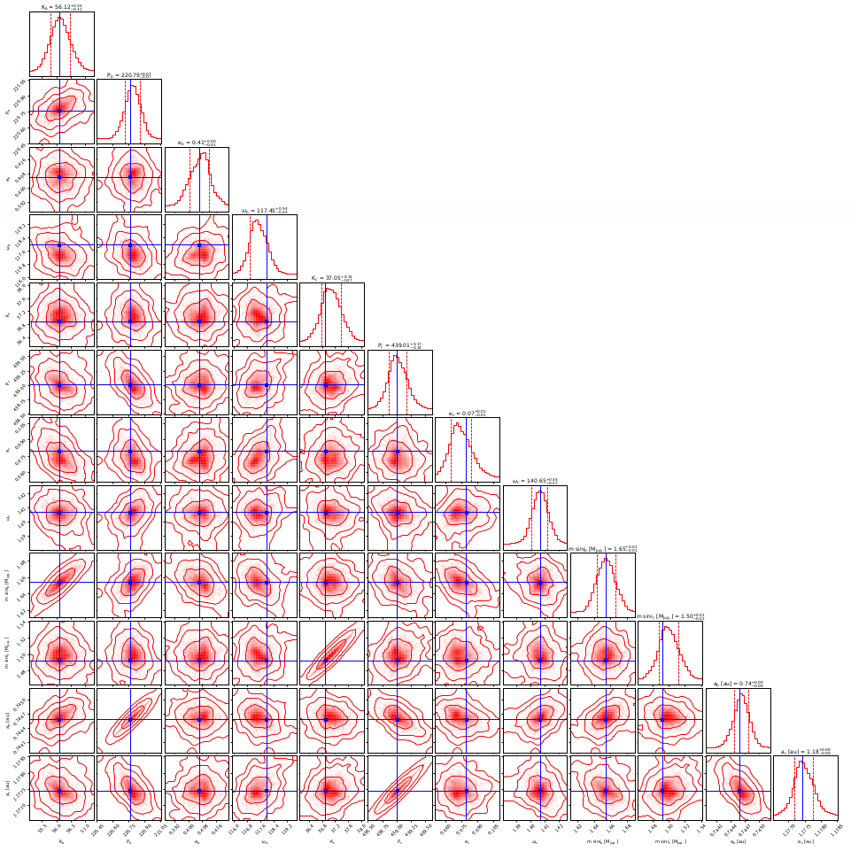
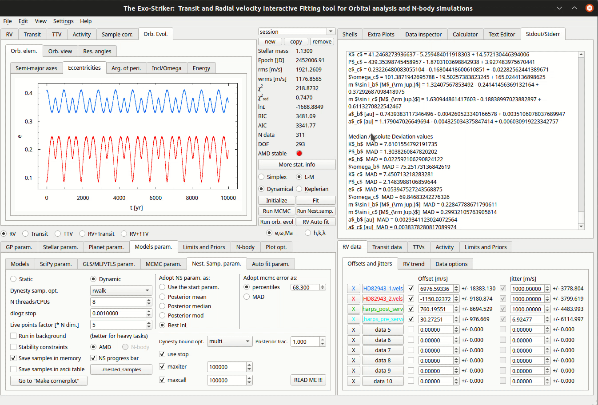
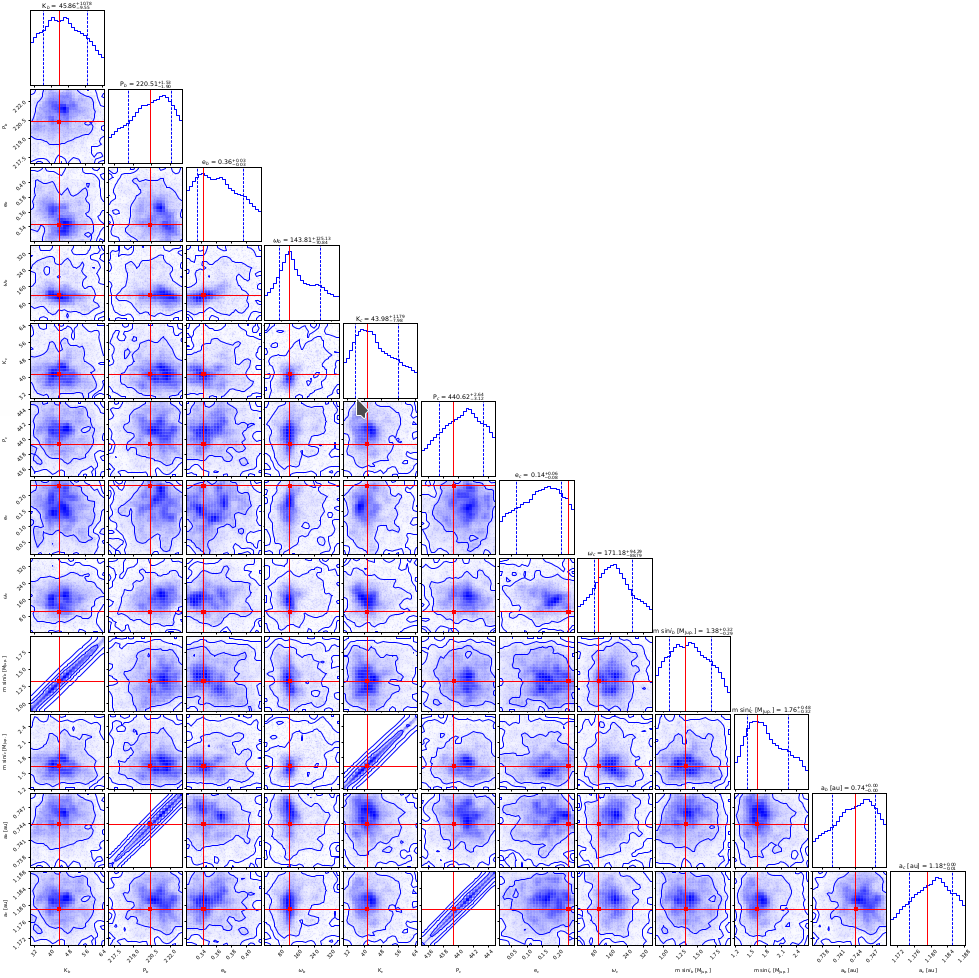

.. _otbfpu:

Parameter Posterior Distributions
...................................

Markov Chain Monte Carlo method
================================

Exo-Striker uses two approaches for approximating parameter posterior distribution and estimating uncertainties of the best fit parameters: the *Markov chain Monte Carlo* and the *Nested Sampling* methods.

The general idea behind the Monte Carlo algorithms is to approximate the posterior distribution of parameters of interest that cannot be calculated exactly, by generating random samples from this distribution. The Markov chain part implies that each sample drawn is probabilistically depending on the current state and not the past. Each sample is added to the chain within the limits and priors that have already been set, and with probability determined by how well it describes the observational data. With time the samples accumulate and start to converge around the desired quantity. 

In Exo-Striker there is a choise for which statistic the samples to converge to: the posterior mean, median or mode, the best log-likelihood, or just use the best fit parameters already obtained. When the process has finished the orbital parameters are adopted as this statistic or remain as they were before that (when **use the start param.** is chosen). The last option is useful when the best fit parameters are calculated using the Simplex method but we need the errors. With the **Best lnL** option, the MCMC works as an optimizer as the orbital set of parameters is updated with the one leading to maximum likelihood.

The MCMC algorithm is dependent on the initial state and as such it is important to have a warm-up step with burning phase samples that are discarded. The real phase of the MCMC starts with the best parameters estimated during the burning phase. Each of the walkers explore the parameters space trying to converge reaching maximum log-likelihood.

.. figure:: images/mcmc.gif
   :target: _images/mcmc.gif

   *Markov Chain Monte Carlo method.*

Before initializing the algorithm there are several model parameters to be set in *MCMC param.* (Models param.) on Parameters panel.

* **Burning phase samp.** : First steps in the MCMC chain to let the walkers map the parameter space.
* **MCMC phase samp.** : Represents the amount of samples of the real MCMC phase (At least 5000).
* **N threads/CPUs** : Number of CPUs from your local machine that will be used for this process.
* **Init. Gaussian Ball** : How far from the starting point the sampler will start producing samples.
* **N walkers factor** : Each walker will produce a different chain that will explore the parameter space (N walkers factor * DOF). 

Usually it is a good idea to save the parameters in the tool's memory so they can be reused when the same session is opened next time.

Now, everything is ready for the MCMC process to start **(Run MCMC)**. 

Sometimes the MCMC process can reach several hours, depending on the amount of samples and the dimensions of the system. You can always check the MCMC progress at the **Stdout/Stderr** on the Accessories panel.

.. NOTE::
   	Keep in mind that setting bounds on the parameters space, on the *Limits and Priors*, in the **Parameters panel** and also limiting the 		data in the **Data panel** is necessary to save computational time because NS maps the whole parameter space.

.. figure:: images/mcmc1.gif
   :target: _images/mcmc1.gif

   *Customize cornerplots.*

When the process is over, the results are printed in the **Stdout/Stderr** window and include the planetary and data parameters and their errors. These values are also populated in the parameter panel where the bigger of the asymmetric errors is pointed out. 

The *Go to "Make Cornerplot"* option in the **Models param.** > **MCMC param.** tab redirects to the *Plot options*. Green indicator means that there are samples in the memory that are required to generate the cornerplot. It is now also possible to print a LaTex table with the parameters and the corresponding uncertainties. If LM method is chosen no need to set asymmetric errors when printing the Latex table as they will be the same as the errors come from the covariance matrix. Otherwise, if MCMC and NS methods have been implemented, choose asymmetric (errors come form the posterior distribution).

By default the cornerplot is saved in the root directory, but this can be modified.
 
The **Customize cornerplot** dynamic window offers modification of the parameter labels and choise whether to include all or some of them in the final plot, to include additional parameters such as planetary mass, and orbit's inclination, to select statistic. In case of transit data, the radius relation is available, so the planet radius can also be included. 

There is also an option to change the number of bins making the histogram on the top of each column. If the **show title** option is selected, the parameter and errors will appear above the histogram.

The cornerplot can be also be reversed in order to occupy the top right part of the plot instead of the bottom left. Usually plot data points remains unchecked because the plot becomes too large. By pressing *Make cornerplot* the final results are extracted on your local exostriker folder as a pdf file. 

   *Final histograms.*

The cornerplot represents the posterior MCMC distribution of the fitted parameters and provide a comparison between the probability density distribution of the overall MCMC samples for each fitted parameter. The two-dimensional parameter distribution panels represent all possible parameter correlations with respect to the chosen statistic (mean, median, best fit, etc.), whose position is marked with a line. The contours around the samples denote whether they lie within 1, 2 or 3 standard deviations (σ). Samples outside of the contours have negligible probability while those inside the inner contour (1 σ credible interval), are equally likely. The best fit usually is inside 1 σ region. The appearance of the statistic and contours can also be modified through the **Customize cornerplot** option.

Further information about `emcee sampler`_ and its modes can be found on `emcee documentation`_.

.. _emcee sampler: https://github.com/dfm/emcee
.. _emcee documentation: https://emcee.readthedocs.io/en/stable/

Nested Sampling method
========================

Nested sampling is another approach for parameter distribution analysis by generating samples from the posterior distribution. NS offers different sampling options that also include breaking the parameter space in different regions, generating samples from each of them and reconstructs the original distribution by applying different weights. NS uses the *dynesty* package. 

.. figure:: images/ns1.gif
   :target: _images/ns1.gif

   *Nested Sampling method.*

Before initializing the algorithm there are several model parameters to be set in *Models param* > *Nest. Samp. param.* tab in the the Parameters panel.

* **Static** : Static sampling, the number of samples remain constant during runtime.
* **Dynamic** : Dynamic sampling, the number of samples vary during runtime in order to maximize calculation accuracy.
* **Dynamic samp. opt.** : Sampling options. Usually random walk is used.
* **N threads/CPUs** : Number of CPUs from your local machine that will be used for the process.
* **dlogz stop** : The minimum change in logz to be reached before suspending the algorithm. In multimodal distributions it is difficult to reach dlogz of 0.01 so there is another option to limit the algorithm runtime: if *use stop* is checked, maximum number of iterations and functions calls can be set.
* **Live points factor** : Number of live points used. It is necessary to set at least 1000 life points (N walkers factor * DOF).
* **Posterior frac.**: this is a percentage that sets weight of static vs. dynamic NS. If the fraction is set to 1 (100%) this is fully dynamic NS which converges to the posterior similarly to MCMC. Otherwise if lower percentage is chosen this means that the algorithm converges more and more to the evidence (Bayesian statistics).

Then, a selection between the options in *Adopt MCMC param. as* is required. To use NS as a minimizer and adopt NS parameters as planetary parameters, check the **best lnL option**. *Dynesty* also supports a number of options for bounding the target distribution (*Dynesty bound opt.*). Unlike MCMC, Nested Sampling starts by randomly sampling from the entire parameter space specified by the prior.

.. NOTE::
   	Keep in mind that setting bounds on the parameters space, on the *Limits and Priors*, in the **Parameters panel** and also limiting the 		data in the **Data panel** is necessary to save computational time.

You can always check the progress of the sampling at *Stdout/Stderr* on the Accessories panel. 

   *Customize cornerplots.*

When the process is over, the Cornerplot can be generated the same way as in MCMC. *Go to "Make Cornerplot"* option redirects to the *Plot options*. There a customization of the cornerplot is offered but also an option to include/exclude parameters from being printed. By pressing *Make cornerplot* the final results are extracted on your local exostriker folder as a .pdf file. 

   *Final histograms.*

As in MCMC represents the posterior distribution of the fitted parameters with correlations marked with cross lines and the contours are constructed from the overall NS samples and indicate the confidence levels (i.e., 1 sigma, etc.).

Further information about `DYNESTY`_ and its modes can be found on `dynestys documentation`_.

.. _DYNESTY: https://github.com/joshspeagle/dynesty
.. _dynestys documentation: https://dynesty.readthedocs.io/en/latest/index.html

.. NOTE::
   The same procedure is applicable when the RVs are combined with Transits.
   
   
