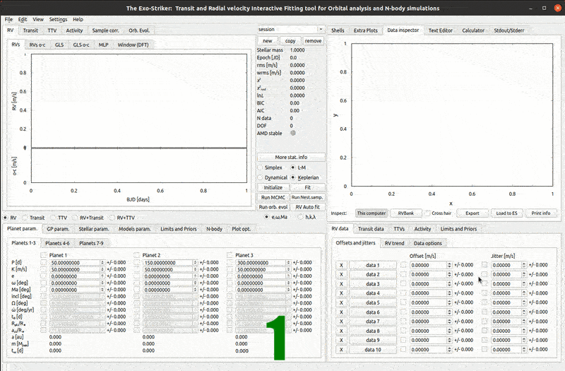
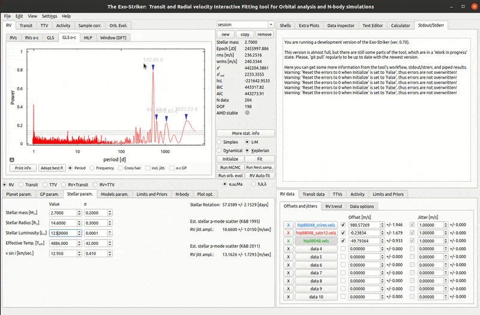
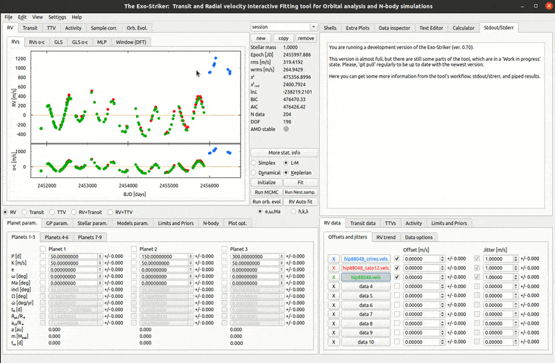
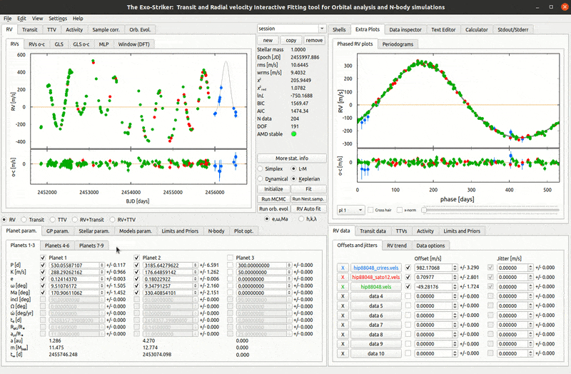
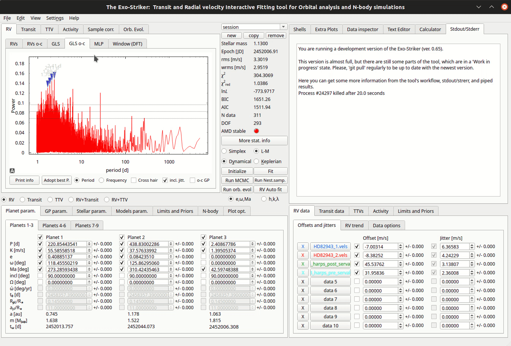
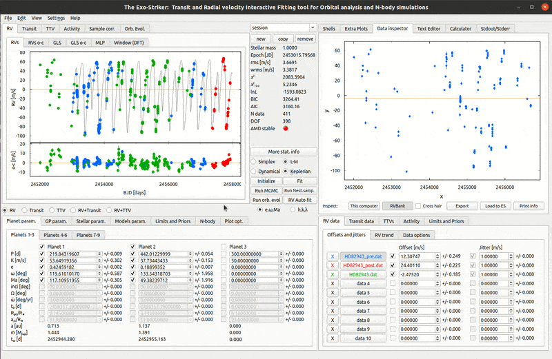

.. _rvs:

Radial Velocity data
....................

Loading RV data
===================

There are 3 ways to load radial velocity (RV) data on exostriker.

*  the **first** is directly from the selection buttons in the **Data panel**.

* the **second** is using the **This computer** selection button in the **Data inspector**.

* the **third** is also through the *Data inspector* but from the **RVBank** option. 

   *Load RV data*

---------------------------------------------------------------------------------------

Fitting RV data
==================

The radial velocity data can be analyzed utilizing either Levenberg-Marquardt (L-M) or Simplex algorithm, and either Keplerian or Dynamic model.
The periodicities in the RV signal are found using the Generalized Lomb-Scargle (GLS) periodogram which scans the data and fits a sinusoidal curve on it.
GLS o-c provides GLS periodogram of the residuals. Fitting with LM algorithm provides information regarding where the data offset is, i.e. it finds the data mean velocity in [m/s]. 

There are several things to do before initializing the data modeling.

1. Refining the RV data.

	* Enter the available stellar data in the **Stellar parameters** tab including the standard deviations.
	
	* Make sure that the check-boxes next to the data are selected which will allow the algorithm to model the data offset. If the signal from any of the data sets is known to have a large offset, this can be entered manually to guide the algorithm.
	
	* Remove aliases by selecting a minimal period larger than 1 day in the **Models param** > **GLS/MLP/TLS** tab.
	
	* Select options for automatic fit from the **Models parameters** > **Auto fit param** tab.
	

	
Fit using the **Fit** or **RV auto fit** option. If auto fit is chosen, the algorithm will perform the next step automatically and find the orbital parameters for the selected number of planets with the certainty depending on the Signal significance threshold.

   *Set parameters for RV data automatic fit*

	
2. Fit manually.

	* Click the **Fit** button to calculate offsets. 

	* If manual fit is selected than the individual set of parameters for each planet should be modeled consecutively. This is done by adopting the best period (highest peak) from the residuals *GLS o-c tab* in the **Visualizations panel** which adds the planet's orbital parameters to the analysis. 
	
	* After adopting the first strongest peak, again click fit and the orbital parameters for the first planet will be refined.
	
	* The sinusoidal curve implies circular orbit; however planetary orbits are hardly ever circular. Check the *orbital eccentricity (e)* and the *argument of periastron (ω)* parameters to allow the model to refine these parameters for ellipsoid orbits (ω is not defined for circular orbits), and fit again to find the **best fit**. Note that in **Extra Plots** a phase diagram of each significant peak, i.e. for each planet found, is displayed and the model will almost match the observational data if a best fit is found.
	
	* If there is another planet in the system, its peak may already be present or becomes evident in the residuals plots after the first peak adopt. Repeat the process until there are no more peaks higher than the false alarm positives (FAP) threshold. Note that a peak is considered significant if it is above the highest of the three FAP thresholds.
	
	* The calculated by the model orbits can be seen in the **Orb. evol.** > **Orb. view** tab. The arguments of periastron is shown with a line.
	
	* Each of the generated plots can be exported with a right click on it that opens a dialog window with export settings.
	

   *Fit data and adopt best period*
   

----------------------------------------------------------------------------------------

L-M or Simplex algorithm
=========================

	* The **L-M** method uses Chi-squared minimization technique to find the best fit parameters including their errors; however it is not suitable for anomaly detection **jitter** cannot be added to the data uncertainty and thus the overall error of the model is underestimated, because it includes observational biases but not the stochastic ones that related to the star itself.

	* The **Simplex** algorithm utilizes maximization of the log-likelihood value. On the other hand, the **Simplex** method allows adding the jitter squared as a part of a penalty term to the model error. When jitter is optimized the Chi-squared reduced (**χ**\ :sup:`2` :sub:`red` \) becomes close to 1. However the Simplex method clears the previously calculated parameter uncertainties, so fit again with L-M to evaluate them. 

Neither L-M, nor Simplex methods can optimize both parameter errors and jitter/jitter error. The approach here is to utilize algorithms for calculating parameter posterior distributions, such as *Markov chain Monte Carlo* and *Nested Sampling*. For more information see :ref:`otbfpu` section. 

	* To see how much the jitter adds to the overall uncertainty of the model, check the *Split jitter* check-box in the **Plot opt** > **RV** tab and choose color. It is now visible in all RV plots.

   *Fit with Simplex algorithm*

	* Furthermore, calculate *MLP (Maximum Likelihood Periodogram)* on **MLP** section, to investigate which periods have significant likelihoods. Detailed statistical information is available with the **Print info** option.

   *Maximum Likelihood Periodogram.*

.. note:: 
	Every significant peak needs investigation on whether it is a planet or stellar activity
	(Check **Activity indicators** on help widgets area, GUI Layout section).
	

----------------------------------------------------------------------------------------

Multiplanetary systems
======================

In case of **multiplanetary systems**, consider the planets masses and distances from each other (close orbits).
Massive planets with close distances from the host star, will surely interact with each other due to gravity. 
Then a further investigation using the **Dynamical model** is necessary. That will take into account the gravitational interactions between the massive bodies by integrating the equations of motion using the *Gragg-Bulirsch-Stoer* method.

   *Dynamical fit.*

Before enabling the **Dynamical** option make sure that the orbital parameters that are acquired so far correspond to the **best Keplerian fit**, because they will be used as an initial guess for this *Dynamical fit*. When choosing dynamical fit, the orbital parameters inclination (i) and the longitude of the ascending node (Ω) become available. The dynamical model has the advantage of being able to fit for mutually inclined orbits. 
Exostriker can also fit planetary systems with coplanar configuration (planets with same inclination i and Ω=0). For this purpose go to **Models param** > **Models** > **RV model** and select the option *Force coplanar incl. in case of dyn. model*. Note that this option is only available with SciPy optimization (selected from the radio-button). Also note that in this case only the inclination for the first planet will be available for update in the **Planet param.** and **Limits and Priors** tabs.

