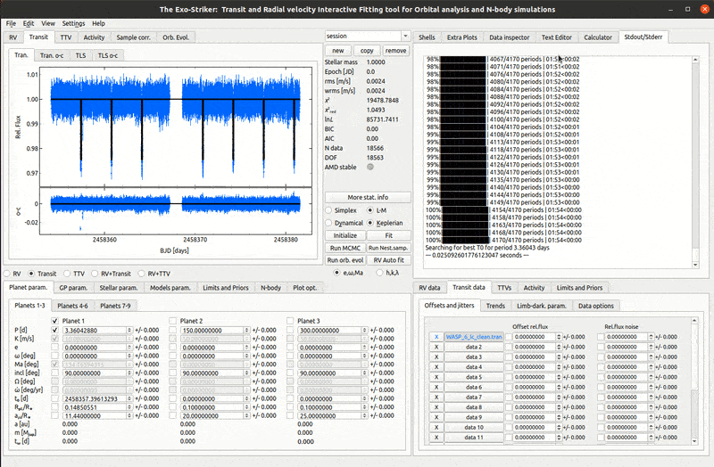
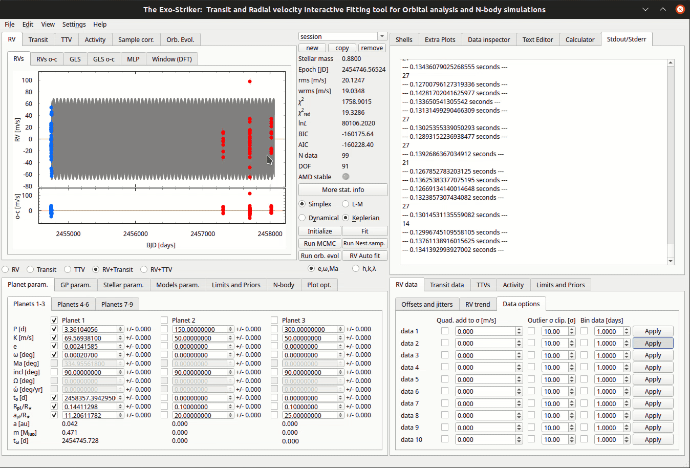

.. _rvtran:

RVs & Transits combined
.......................

Obtaining the Mass of a planet
==============================

It is difficult to obtain the planetary mass directly from transit signal. This implies that it will be also difficult to distinguish for example a hot Jupiter planet from a brown dwarf. For this reason often transit data is combined with radial velocity data if it is available. After loading Transit and RV data for a planetary system, choose the *RV+Transit* option in **Visualizations panel**. Then click initialize. Thus the log likelihood of both transit and RV data will be calculated and a combined model will be constructed.

In order to optimize the planetary parameters, it is a good idea to start by first optimizing only the period (P [d]), semi-amplitude (K [m/s]),
and the offset (with L-M) and jitter (with Simplex) using the **RV** option in order to help the model. After that select **RV + Transit**, check the other parameters and optimize again for both types of data to construct a joint model. This trick works because RV data optimizing uses Fortran which is faster than SciPy (Python).

   *Combining RV and Transit data.*

In the *Models param.* > *Models* tab check **first RB [BJD]** for epoch which will default the epoch to the first observation. This is especially useful when the order of data loaded to Exo-Striker is not chronological.

.. ATTENTION::
   	Keep in mind that when optimizing RV + transit data with Keplerian model, the parameter **t**\ :sub:`0`\ **[d]** in the Parameters panel 		is the main parameter which defines the planet's phase (the time of the *first* transit) and the mean anomaly (Ma, which defines where on
   	it orbit is the planet in a given epoch) is automatically calculated. On the other hand, if we choose dynamical model, the main parameter
   	is Ma. Also the parameter **t**\ :sub:`ω`\ **[d]** (Epoch) represents the time of the *first* RV measurement.

After combining both data sets, the first estimation of the **planets mass** is obtained. In order to have a better estimation acquired, it is necessary to include the stellar parameters such as stellar mass and radius to the model. As soon as the statistical parameters are optimized, the the model is ready to go through MCMC or Nested sampling for the obtaining posterior errors. MCMC and NS can also be used as optimizers for the joint model by checking the best log likelihood option. 

(For more information check *Obtaining the best fit parameters uncertainties Ι & ΙΙ sections*).

---------------------------------------------------------------------------------------------------------------

Binning data points
===================

Sometimes it will be necessary to **bin RV data points** when the data set has many observations during a 
very short period of time. This procedure can lead to a better model estimation.  

   *Binning data.*

In the example above the data set has ~10 RV observations in a time span of 1 hour. By binning the
data through eg. 0.02 days, you only accept RV measurements with minimum period of ~30 minutes between 
2 observations.

