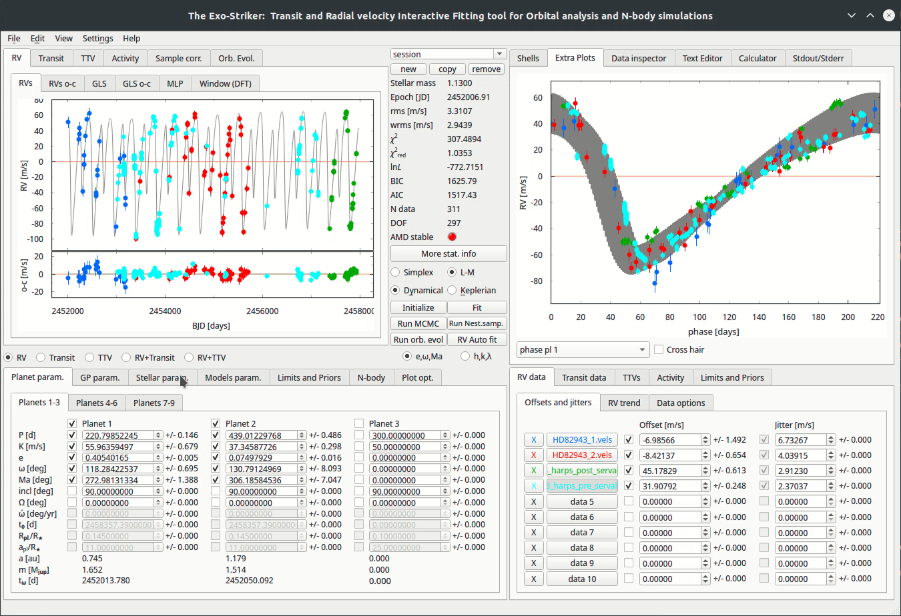

.. _stability:

Stability analysis
..................

Performing an orbital evolution
===============================

For the planetary parameters estimation to be complete, a stability analysis should also be performed. Not only the best fit parameters have to be those with highest probability from the posterior analysis, but they must be stable for large periods of time. 

If there is only one planet in a system, the eccentricity would be a straight line; however multiple planets in a planetary system interact with each other during large periods of time, exchanging energy and momentum each time they are in their closest approach. During this interaction, the eccentricity of one of the planets increases and the other decreases, and when one is at its maximum, the other eccentricity reaches its minimum.
Meanwhile the planetary axes change to a much lesser extent. What is the most important for the evaluating planetary evolution are the mean eccentricities for this large timescale.
For planetary systems with more than 2 planets, other (secular) effects take place and the eccentricities are no longer cyclic functions.
Orbital evolution can be analyzed using the *SyMBA N-body symplectic integrator*, that calculates how the orbital parameters develop with time.

The orbital elements that evolve with time include:

* Semi-major axes of the planets
* Orbital eccentricities
* The arguments of periastron
* Inclination/longitude of the ascending node
* Energy

.. figure:: images/1orbitalevo.gif
   :target: _images/1orbitalevo.gif

   Running an *orbital evolution* with Keplerian model.

If the planetary system is stable we can investigate its dynamical properties, such as the resonant angles. 
To investigate the resonant angles, use the *Plot opt.* > *N-body* > *Res. Angles* tab in the Paramaters panel. 
On the left side from the drop-down menu choose planets in resonance and the Mean motion resonance with the alleged angles. 
Note that the number of angles is the resonance order plus 1. One of these is enough to librate, as well as the argument of periastron, in order the system to be in resonance.
For example if the planets are in 2:1 resonance, this is a first order resonance and there are two resonant angles. Also note that for the planets to be in a mean motion resonance the ratio of their orbitals must be a little larger (about a percent) than the whole number. For example for two planets to be in 2:1 resonance the period of the outer planet must be a little more than 2 times longer than that of the inner planet.

First the stellar parameters need to be entered within the *Stellar param.* tab on the Parameters panel. Then in the *N-body* tab add the maximum time of evolution and the appropriate time step. The time step is the period at which the planetary interactions are re-calculated while the inner planet drifts on the Keplerin orbit. At least 100 points per orbit should be set so that the calculations are smooth enough. For example, if the inner planet has a period of 200 days, then a time step of 2 days is required. Running orbital evolution **(Run orb. evol)** automatically redirects to the *Orb. Evol* section, where the orbital parameters evolution is revealed.

   Running an *orbital evolution* with Dynamical model.

Generally, the **AMD stable inidicator**, at the Statistics and control section, automatically indicates if a system is stable, by turning into green. 
Besides that, evaluating the stability of a system means that the orbital parameters have to be examined long-term (e.g 1Myr). 
In case of planet-planet close encounters *SyMBA* automatically reduces the time step to ensure an accurate simulation with high orbital resolution. *SyMBA* also checks for planet-planet or planet-star collisions or planetary ejections and interrupts the integration if they occur. 

----------------------------------------------------------------------------------------------------

Test arbitrary configuration
============================

In the *test arbitrary configuration* section orbital evolution tests with fixed values of planetary parameters can be set to examine the resulting evolutionary parameters.

   *Test arbitrary configuration.*

Options between the planets RV amplitude & period **or** planets mass & semimajor axis are provided. 

----------------------------------------------------------------------------------------------------

Integrate mcmc/Nest. Samp. (Work in progress)

This option would offer integration of many samples derived from MCMC or NS models on one plot when implemented.

