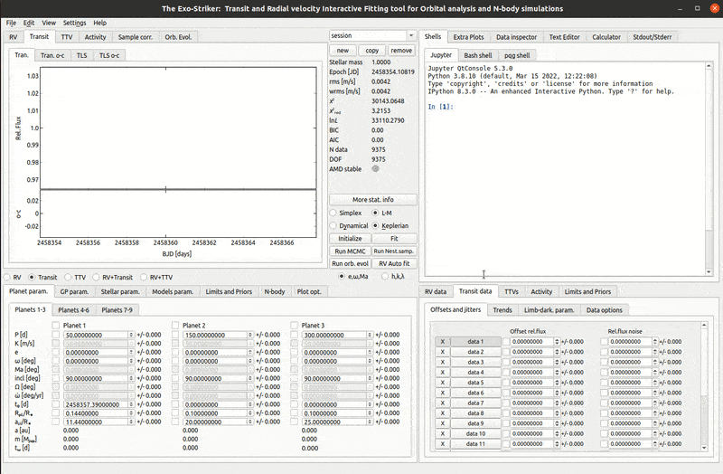
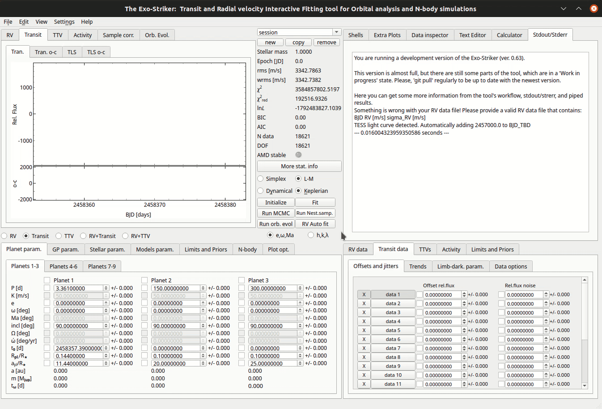
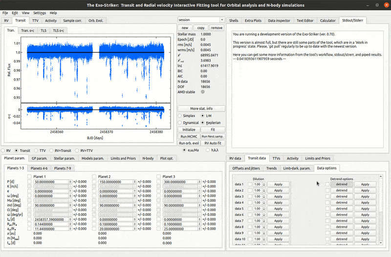
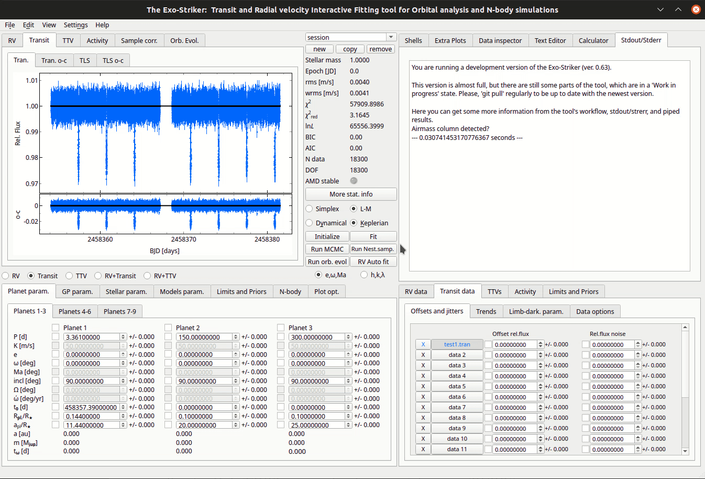
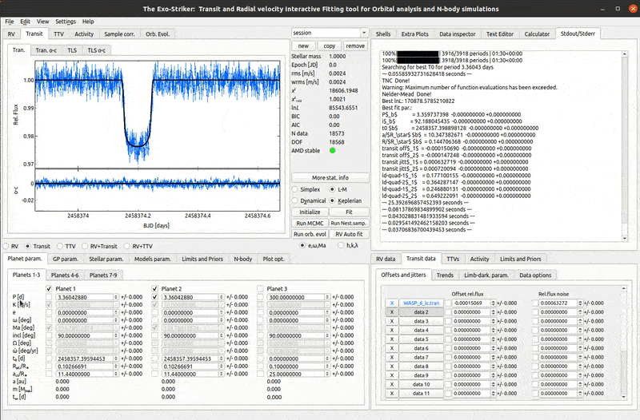
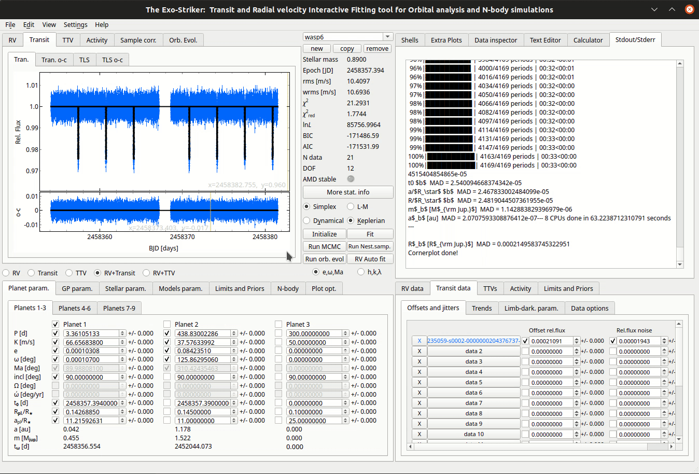
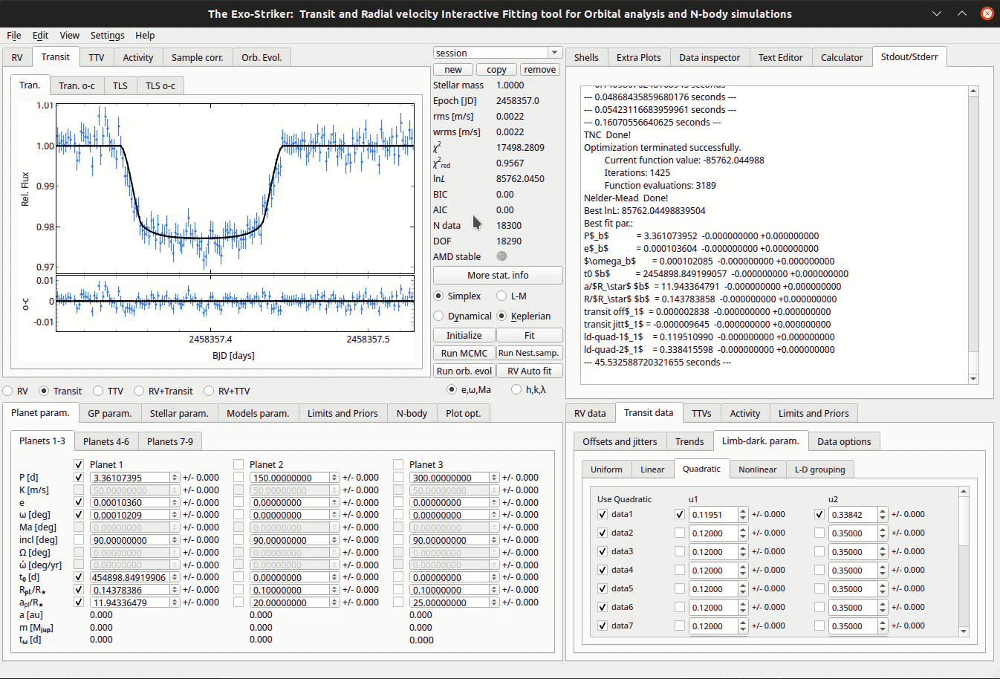

.. _transit:

Transit data
............

There are 3 ways to load Transit data on exostriker.

1. Through the *Data panel*.

2. Through the option *This computer* in **Data inspector** on the *Accessories panel*. If the file has .tran extension, Exo-Striker populates the data in the Transit data tab, while .vels files are automatically entered in the RV data tab.

   *Load transit data*
   
   
   .. note::
	Usually gaps in transit data from the Transiting Exoplanet Survey Satellite (TESS) signify the so called downlink when the telescope is sending data to Earth and cannot perform observations.

3. There is an option to download transit data in .fits (Flexible Image Transport System) format. In this case a pop up appears with two options:

        SAP FLUX (Simple Aperture Photometry) : raw data.
        PDCSAP FLUX : cleaner data than the SAP flux with fewer systematic trends (recommended).

   *Load fits data*

Fits transit data from several missions including TESS is available in the data archive web page "The Mikulski Archive for Space Telescopes". From here data for a given planetary system can be downloaded in a .zip file. After extracting, choose the file with "lc" in the end of the file name.
   
---------------------------------------------------------------------------------------------

Detrend the Light curve
========================
 
After the transit data is inserted, it still needs to be processed, because it has systematic errors, outliers and other artifacts which can mask the real transits. Physical processes behind these errors include but are not limited to star activity, starspots that can migrate and also vary in number, systematic errors from the observational instruments, light contaminators in the field of view.

For that process *Exo-Striker* has **detrend** option in the *Data options* tab. When clicked, the detrend button opens a new window with 2 interactive plots. The upper shows the model applied on the transit data.The lower one displays the residuals by default but with the radio buttons below the **Try!** option, it can be modified to show a periodogram of the light curve or the model. The wotan package is implemented in *Exo-Striker* and it automatically filters trends from time-series data by interpolating a model, which can be polynomial, splines, moving average, etc. on the raw transit data. The normalization algorithms include different kernels to choose from, and in addition the Gaussian Processes model has an option robust, which, when checked, will filter the transits and apply only to non-transit deviations in data.  

  
There is an option to bin the data per a chosen time period, and also to save the error free detrended data as a .tran file.  
More information regarding the package is available in the **READ ME** option in the **Detrend** window as well as in `wotan`_ and its `documentation`_ links.

.. _wotan: https://github.com/hippke/wotan

.. _documentation: https://wotan.readthedocs.io/en/latest/

Inside the **Detrend** window, there is also an option to remove outliers, one by one by clicking on each, or using a scalable region of interest (ROI) box for bulk removal. The coordinates of the removed points appear in the **Stdout/Stderr** window.
	
   
    .. WARNING::
	In order for the Gaussian processes to be an available option it is necessary to additionally install the **sklearn** Python library!
	
After the transit data is cleaned, the **Detrend** window can be closed as the detrended curve is in the tool's memory. Then check the box on the left of the detrend button and click **apply**. The detrended data can also be saved from the window in a .dat file which contains information for the original data as well.

   *Detrending and remove outliers.*
	  
----------------------------------------------------------------------------

Finding the transit period
============================

When the light curve is detrended, a *period search* using the *Transit Least Squares (TLS)* algorithm can be performed. This is done from the window **TLS o-c** with the residuals from the normalized light curve, with the button **(Calcute TLS)**. The result is a periodogram with a prominent peak and its harmonics (1/2x, 2x, 4x,.. of the main signal). The empirical transit detection threshold is SDE > 8, Signal Detection Efficiency, (Aigrain et al. 2016), but the SDE levels can be set from the tab **Model param** > **GLS/MLP/TLS param**. There is also an option to set minimum and maximum period of transit after obtaining it visually from the curve (you can use cross hair check boxes in **Plot opt.** > **Transit**, to check where the transits are if they are distinct enough).

When TLS o-c is being calculated, the number of tested periods is displayed in a progress bar in **Stdout/Stderr**.

   *Transit period search.*

After the transit period is calculated, there is additional statistical and transit parameters information in the tool's memory which can be obtained by calling the fit object in the **Jupyter shell** window:

``fit.tlc_o_c``

----------------------------------------------------------------------------

Fitting planetary parameters.
==============================

A crude light curve that fits the data is built by clicking **Adopt best period**. It can be further refined by optimizing the planetary parameters in the *Parameters panel*. Those included in the analysis are the transit period (**P [d]**), and phase (**t**\ :sub:`0`\ **[d]**), the inclination, **R**\ :sub:`pl`\ /**R**\*\, 
which gives the transit depth, **a**\ :sub:`pl`\ /**R**\*\, 
that gives the length of the transit, as well as the *Offsets and jitters* denoted as offset rel. flux and Rel. flux noise in the Transit data.
Additional parameters to be included are the **Limb-darkening parameters**, which follow from the gradual decrease in brightness of the disk observed from the center of a star to its edge (limb). The exact transit signal shape can be described by setting one of four types of LD coefficients: uniform, linear, quadratic and nonlinear. Uniform and linear are seldom used as they are too simple and set too rough edges of the transit signal. Quadratic coefficients are used the most. The **u** coefficients are set per each data set, because they differ for different telescopes. Do not use **Limits and priors** > **Limb-dark params** to set LD priors as they are not well defined. 

Because the Limb-darkening coefficients are the same for a given telescope, the last option **L-D grouping** allows for grouping data by telescope which it was collected with, by assigning a number to it. For example, if the first 3 data sets in the Transit data are from the one telescope, and the following 2 from another telescope, set the number 1 to data1, data2, and data3, and the number 2 to data4 and data5.

After setting the parameters to be included in the model, there is an option to set minimizing parameters in the **Models param** > **SciPy param. tab**. Note that the only available minimizing algorithm for transit data is based on SciPy, while for RV data also Fortran based algorithm can be used. Usually the default Truncated Newton (TNC) and Nelder-Mead methods are applied, and there is choice to run each of them more than once.
The TNC is more or less similar to the LM method and the Nelder-Mead method works more or less like the Simplex method for RV data. MCMC can also be used as minimizer.

   *Fitting a transit.*
   
The **phase folded planetary signal** can be investigated on *Plot opt.*, when the option
*plot phase-folded* is enabled.

   *Phase folded transit.*

* Checking the **residual signal**.

If there are any other periodicities left on the residual signal they can be calculated
on the *TLS o-c section*. If there aren't any peaks left on the *TLS o-c graph*, a message that 
*You have reached the maximum number of TLS peaks* will be shown on *Stdout/Stderr* panel.

   *Residual signal.*

